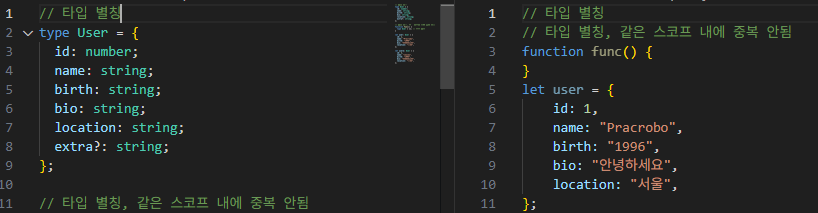
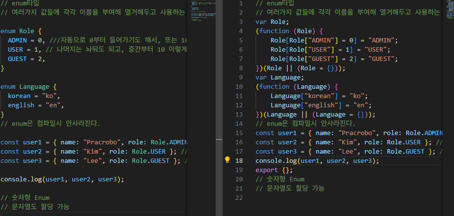

## 튜플

왼쪽 chater2.ts/ 오른쪽 chater2.js


- 컴파일시 배열로 작성된다.

## 타입 별칭

- 컴파일시 타입 별칭은 사라진다.
  

## 인덱스 시그니처

- 위반할 프로퍼티가 없어도 오류가 안난다.
- 반드시 있어야 한다면,

```ts
type CountryNumberCodes = {
  [key: string]: number;
  Korea: number; //여기 부분에 추가
};

let countryNumberCodes: CountryNumberCodes = {
  Korea: 410,
  UnitedState: 840,
  UnitedKingdom: 826,
};
```

- value 타입과 호환하거나 일치해야 한다.

## Enum 타입


