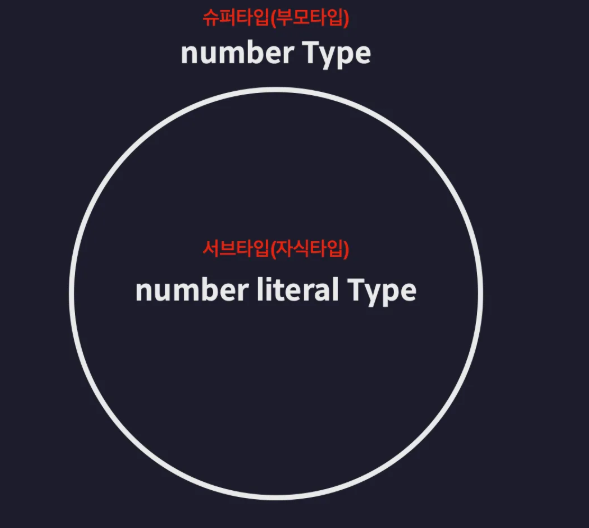

# 타입 스크립트를 이해한다는 것은?

## 어떤 기준으로 타입을 정의하는지

## 어떤 기준으로 타입간의 관계를 정의하는지

## 어떤 기준으로 타입의 오류를 검사하는지

## 타입은 집합이다!

타입 = 집합

- 동일한 속성, 특징을 갖는 요소를 하나의 단위로 묶는 것을 의미한다.

number literal type

```ts
let num: 20 = 20;
```

number type(super type 부모타입)의 집합 number literal type(subtype 자식타입)


### 타입 계층도


타입 호환성: 어떤 타입을 다른 타입으로 취급해도 괜찮은지 판단하는 것


```ts
let num1: number = 10;
let num2: 10 = 10;

num1 = num2; // 가능
num2 = num1; // 불가능
```


### upcasting

sub 타입을 super 타입의 값으로 취급하는 것을 업캐스팅

### downcasting

super 타입을 sub 타입의 값으로 취급하는 것을 다운캐스팅, 대부분의 경우 불가능하다

### 타입 호환도


